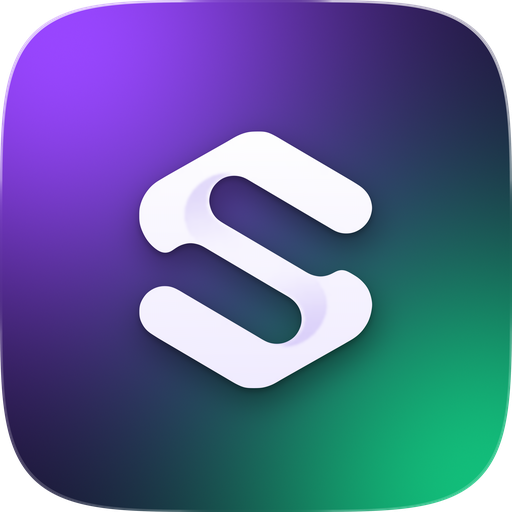

<p align="center">
  
</p>

<h1 align="center">Strak</h1>

<p align="center"><b>Tokenized stocks on Solana. Is the volume real.</b></p>

<p align="center">
  <a href="https://strak-six.vercel.app">Site</a> ·
  <a href="https://strak-six.vercel.app/app">Terminal</a> ·
  <a href="https://strak-six.vercel.app/docs">Docs</a> ·
  <a href="https://strak-six.vercel.app/docs#api">API</a>
</p>

---

Every tokenized stock on Solana (xStocks, Ondo, Backpack Securities) on one screen, scored by one number no price screen shows: **turnover**, the 24h volume divided by the liquidity behind it.

```
turnover = volume 24h / liquidity
```

| Turnover | Reading | The whole pool changes hands every |
|---|---|---|
| up to 12x | normal trading | 2 hours or slower |
| 12x to 50x | suspiciously hot | 29 min to 2 hours |
| above 50x | volume is painted | faster than 29 minutes, all day |

Turnover says the volume doesn't fit the pool. The live swaps say who is making it: how many wallets, how much of the volume the top three carry, and how many wallets both bought and sold inside the window.

On 23.09.2026 IONQ from Backpack Securities printed **152.4x**: $16.5M of volume on $107K of liquidity. Two days later it read 3.7x on the same depth.

## What's in here

```
api/
  registry.js     live board: Jupiter + DexScreener, CDN-cached 5 min
  candles.js      GeckoTerminal OHLCV proxy (browsers get 429 without CORS)
  sparks.js       24 hourly closes for the landing's sparklines, cached 30 min
  trades.js       last 300 swaps of a pool and who made them, cached 20 s
lib/
  registry.mjs    the one builder both the API and the scripts use
public/
  index.html      landing
  app/            the terminal
  docs.html       documentation
  data/           static snapshot and dated case files
scripts/
  build-registry.mjs   write public/data/equities.json
  snapshot.mjs         append one hourly line to history/
  dev.mjs              local server for public/ and api/
history/          hourly snapshots of the whole board, one file per day
```

## Run it

No dependencies, Node 20+.

```bash
node scripts/dev.mjs          # http://localhost:4173
node scripts/build-registry.mjs
node scripts/snapshot.mjs
```

## Data

| Source | Used for |
|---|---|
| [Jupiter](https://dev.jup.ag) verified token list | universe, price, 24h volume, liquidity, holders |
| [DexScreener](https://docs.dexscreener.com) | deepest pool per token, pool price change |
| [GeckoTerminal](https://www.geckoterminal.com/dex-api) | candles, sparklines, swaps |

All free, no keys. The inclusion rules, the field reference and the API are in the [docs](https://strak-six.vercel.app/docs).

## History

`.github/workflows/snapshot.yml` runs `scripts/snapshot.mjs` every hour and commits the result. Each line of `history/<date>.ndjson` is the whole board at that hour:

```json
{"t": 1790373411174, "rows": [["DJT", "backpack", 9.14, 488379, 13713725, 28.08], ...]}
```

`[symbol, issuer, price, liquidity, volume 24h, turnover]`. Every stock seen above 50x lands in `history/cases.json` with its date.

---

Informational only. Not financial advice.
